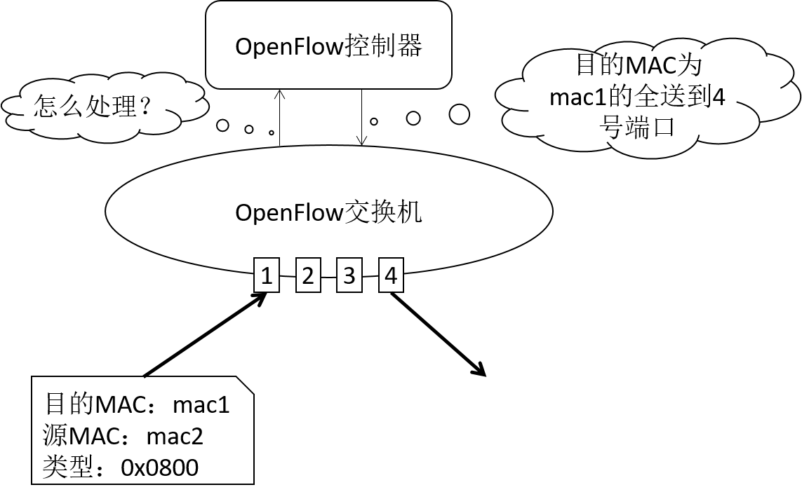
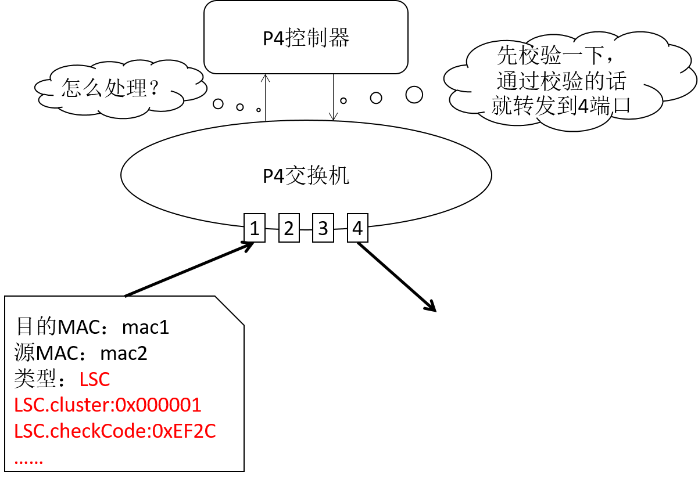
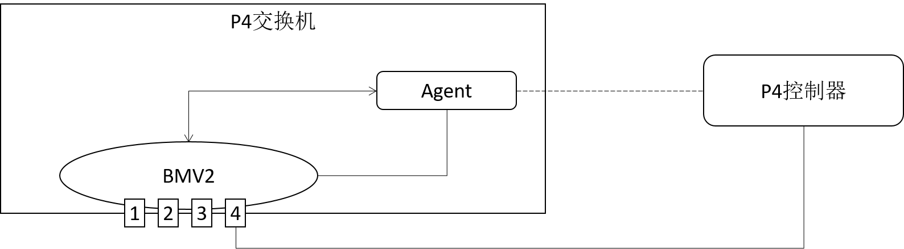

# SDN 项目环境安装指南
## 系统需求
Ubuntu 16.04，硬盘 > 20G，内存 > 4G。

在其他版本的 Ubuntu 上可能会无法编译通过。

## 安装 P4 开发环境
1. 安装基础依赖

    执行 `bash ./install-basic.sh`。

    本过程根据实际网速和电脑性能的差异而有较大变化，预计完成时间在 10min 左右。如果网速太慢，请尝试更换国内源。


2.  编译 P4C、PI、BMV2

    执行 `bash ./install-P4.sh`。

    本过程根据实际网速和电脑性能的差异而有较大变化，预计完成时间在 40min 左右。如果网速太慢，请尝试更换国内源。

3. 检查是否安装成功

    输入 `simple_switch_CLI` 并回车，如果出现如下图所示的内容，恭喜你已经完成了基础环境的安装

## 编译项目工程
1. 安装依赖，下载源文件

    运行 `install-sdn.sh`

2. 编译运行

    编译运行控制器：
    ```
    cd sdn-soft
    make start-env-con
    make build-controller
    make run-controller
    ```

    编译交换机：
    ```
    cd sdn-soft
    make start-env-sw
    make build-sw
    make run-sw
    ```

## 关于本项目
首先恭喜大家成功的搭建起了环境，欢迎大家加入 SDN 项目组。

在展示本项目的框架前，请先允许我简要介绍一下 OpenFlow 和 P4。

OpenFlow，是一种网络通信协议，属于数据链路层，能够控制网上交换器或路由器的转发平面（forwarding plane），借此改变网络数据包所走的网络路径。

OpenFlow 的基本工作原理如下图所示，OpenFlow 交换机收到报文后，会将报文发送给 OpenFlow 控制器（即 Packet_in），询问如何处理该报文。控制器收到报文后，根据网络管理员配置的策略计算出交换机的行为，并将结果返回给交换机（即 Packet_out 和 FlowMod）。



OpenFlow 就是这么的简单而又高效。但高效往往意味着死板，OpenFlow 协议只支持处理 IP 相关报文，这也是我们项目不用 OpenFlow 的原因。我们的项目自定义了一种叫做 LSC 的协议。

P4 的优势就在于可以通过编程的方式来定义 P4 交换机的转发行为，这样就可以转发我们的 LSC 协议报文啦。



P4 可以粗略的分为三块：BMV2、PI 和 P4C。BMV2 负责根据我们编写的规则进行转发；P4C 负责将我们编写的代码编译为 BMV2 可以理解的格式；PI 负责在 BMV2 运行过程中修改其包处理参数。

我们项目整体的架构如下。BMV2 负责数据报文的转发；当 BMV2 遇到不知道如何转发的报文时，就将报文送到给本机的 Agent，由 Agent 完成与控制器的交互，最终 Agent 将控制器下发的处理行为实装到 BMV2 中。



## 如果你想了解更多
1. P4

    https://github.com/p4lang/tutorials

2. LSC 协议

    群里的协议文件有点老旧了，和学长学姐要一下文档吧~


## Others
本项目为涉密项目，请勿外传本项目的技术细节嗷
